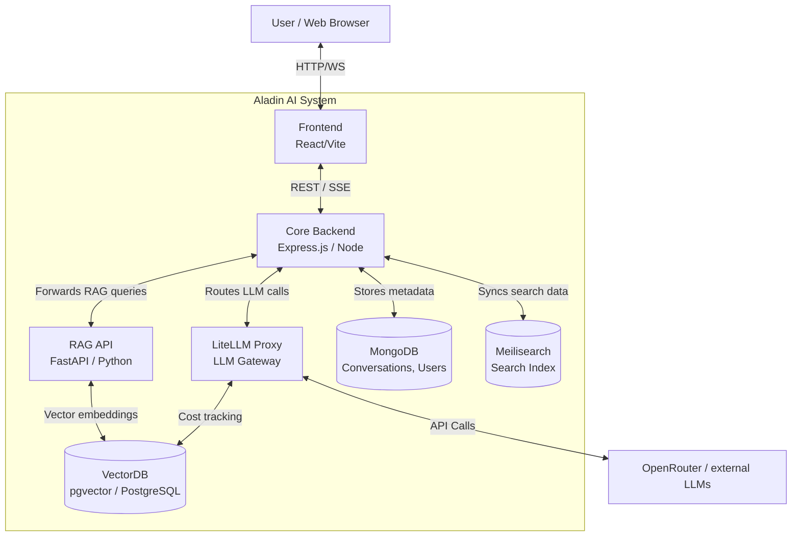

# Aladin AI Architecture

This document provides a comprehensive end-to-end overview of the Aladin AI architecture, including its core components, data flow, directory structure, and deployment pipeline.

## 1. High-Level Overview

Aladin AI is a state-of-the-art conversational AI platform designed around a microservices architecture. It features a modern, responsive web frontend, a robust Express-based core backend, a specialized Python FastAPI service for RAG (Retrieval-Augmented Generation), and various support databases to handle conversations, vector embeddings, and search indexing.

## 2. System Architecture Diagram



## 3. Component Breakdown

### Frontend (Client)
- **Tech Stack**: React 18, Vite, TailwindCSS, Radix UI, TanStack Query.
- **Role**: Provides the sleek, glassmorphic dark-themed UI. Handles user authentication state, chat interfaces, and real-time streaming updates (Server-Sent Events) from the backend.

### Core Backend (API)
- **Tech Stack**: Node.js, Express, Mongoose.
- **Role**: Acts as the central orchestrator. It handles user authentication (Passport.js), manages chat histories, agents, and plugins. It streams responses back to the frontend and acts as a router to internal AI services.
- **Packages/Integrations**: LangChain (JS), Firebase, Passport (various strategies), Azure, AWS SDK.

### RAG API (Retrieval-Augmented Generation)
- **Tech Stack**: Python, FastAPI, LangChain (Python).
- **Role**: Specialized service for document parsing, chunking, and creating embeddings. It connects to the VectorDB to retrieve relevant context for user prompts involving file uploads or document chat.

### LiteLLM Proxy
- **Tech Stack**: Python (BerriAI LiteLLM).
- **Role**: An LLM gateway that unifies multiple AI provider APIs (e.g., OpenRouter, OpenAI, Anthropic, Gemini). It handles rate limiting, cost tracking (stored in PostgreSQL), and API key management.

### Databases
- **MongoDB**: The primary document database storing user profiles, chat sessions, message histories, and system configurations.
- **VectorDB (pgvector/PostgreSQL)**: Stores high-dimensional vector embeddings generated by the RAG API for semantic search, as well as LiteLLM metadata.
- **Meilisearch**: A blazing-fast search engine indexing chat histories and prompts to allow users to search through their past conversations instantly.

## 4. End-to-End Data Flow (Message Processing)

1. **Input**: A user types a message in the React Frontend and hits send.
2. **API Request**: The Frontend sends an HTTP request to the Core Backend (`/api/messages`).
3. **Authentication & Validation**: The Core Backend validates the session (JWT/Cookies) and checks user quotas or balance.
4. **Context Retrieval (if applicable)**:
   - If the user is chatting with a document, the Core Backend calls the **RAG API**.
   - The RAG API queries the **VectorDB** for semantic matches to the user's prompt and returns relevant text chunks.
5. **Prompt Assembly**: The Core Backend constructs the final prompt, appending the retrieved context and system instructions.
6. **LLM Routing**: The assembled prompt is sent to the **LiteLLM Proxy** (or directly to an external API like OpenRouter).
7. **Streaming Response**: As the external LLM generates tokens, LiteLLM passes them back to the Core Backend, which streams them to the Frontend via Server-Sent Events (SSE).
8. **Storage & Indexing**: Once complete, the full message is saved in **MongoDB** and asynchronously indexed in **Meilisearch**.

## 5. Directory Structure Map

```text
Aladin/
├── .github/          # GitHub Actions CI/CD workflows
├── aladin-rag-api/   # Python FastAPI service for Retrieval-Augmented Generation
│   ├── Dockerfile
│   ├── main.py
│   └── requirements.txt
├── api/              # Core Node.js Express Backend
│   ├── app/          # Application logic, routes, and controllers
│   ├── models/       # Mongoose database schemas
│   ├── server/       # Server initialization
│   └── package.json
├── client/           # React Frontend
│   ├── src/          # React components, hooks, and views
│   ├── public/       # Static assets, images, and icons
│   └── package.json
├── Models/           # Model configuration or local model weights
├── packages/         # Shared internal packages or libraries
├── docker-compose.yml# Main Docker orchestration file
├── aladin.yaml       # Core application configuration file
└── README.md         # Project overview and quick start guide
```

## 6. Deployment and CI/CD

- **Docker Compose**: The entire stack is orchestrated using `docker-compose.yml`. It brings up the API, MongoDB, Meilisearch, VectorDB, LiteLLM, and RAG API containers, ensuring all internal networking is configured correctly.
- **Environment Management**: Configuration is managed via `.env` files and `aladin.yaml`, securely loading API keys without hardcoding them in the repository.
- **CI/CD Pipeline (GitHub Actions)**:
  - **`dev` Branch**: Triggers automated testing (Jest) to ensure stability.
  - **`prod` Branch**: Triggers tests, builds Docker images (`Dockerfile.multi`), and publishes them to the GitHub Container Registry.
