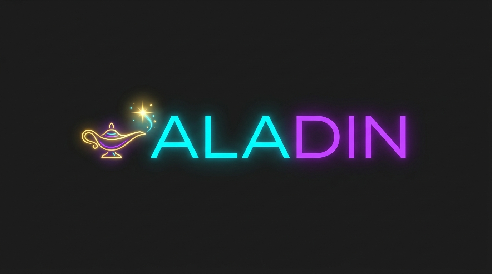

<p align="center">
  
  <h1 align="center">Aladin AI</h1>
  <p align="center"><em>Where dreams meet reality</em></p>
</p>

## ✨ About Aladin AI

Aladin AI is a premium, state-of-the-art conversational AI platform designed with a sleek, glassmorphic dark theme and seamless integrations. It brings together the future of assistant AIs with a highly customizable and beautiful UI experience. 

With Aladin AI, you can connect directly to powerful models via OpenRouter or other AI providers without compromising on aesthetics or performance.

## 🚀 Features

- 🖥️ **Premium UI & Experience:** Sleek, modern dark mode featuring deep charcoal surfaces, neon glowing accents, and glassmorphic panels for an unparalleled user experience.
- 🤖 **Universal AI Integration:** Plug in your OpenRouter API key and automatically fetch the latest free and premium models, including ChatGPT, Claude, Llama 3, Gemini, and more.
- 🔧 **Code Interpreter:** Secure, sandboxed code execution directly in the chat.
- 🔦 **Aladin Agents:** Build, configure, and share specialized AI agents that utilize tools, file search, and web browsing capabilities.
- 🎨 **Image Generation & Vision:** Generate stunning images right inside the chat, and upload files for advanced vision processing.
- 💬 **Multimodal Interactions:** Chat with PDFs, documents, images, and more.
- 🌎 **Multilingual UI:** Fully localized UI.
- 👥 **Multi-User Ready:** Secure authentication and management for multiple users across the platform.

## 🛠️ Quick Start

Aladin AI uses Docker for rapid, reliable deployment.

### 1. Prerequisites
- Docker & Docker Compose
- Node.js (for local development)

### 2. Setup Configuration
Copy the example environment file and configure your settings:
```bash
cp .env.example .env
```
Ensure that your `.env` explicitly loads the Aladin config:
```bash
CONFIG_PATH="/home/jeko/Xcorp projects/Aladin/aladin.yaml"
```

### 3. Run with Docker
Start up your Aladin AI instance:
```bash
docker-compose up -d
```
The application will be available at `http://localhost:3080`.

## ⚙️ Development & CI/CD

Aladin AI is equipped with a robust GitHub Actions CI/CD pipeline:
- **`dev` branch**: Commits trigger automated tests.
- **`prod` branch**: Commits trigger tests, Docker image builds, and automatic publishing to the GitHub Container Registry.

## 🔒 Copyright & Security
Aladin AI is fully re-branded and secured. OpenRouter API keys and credentials are strictly loaded through secure environment variables (`aladin.yaml` and `.env`), ensuring a safe deployment environment for production.
